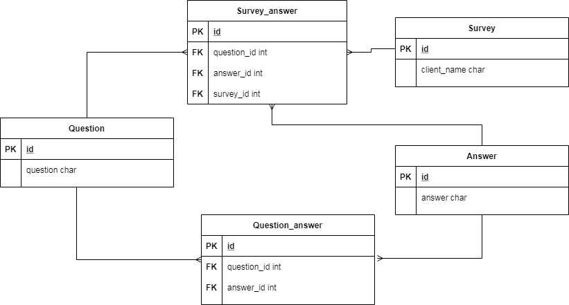

# Survey Services

La estructura de la base de datos se observa en el siguiente diagrama relacional:

##### - Información:

- **Proyecto**: survey-service
- **Puerto**: 80
- **Swagger**: http://localhost:8080/swagger-ui.html#/
